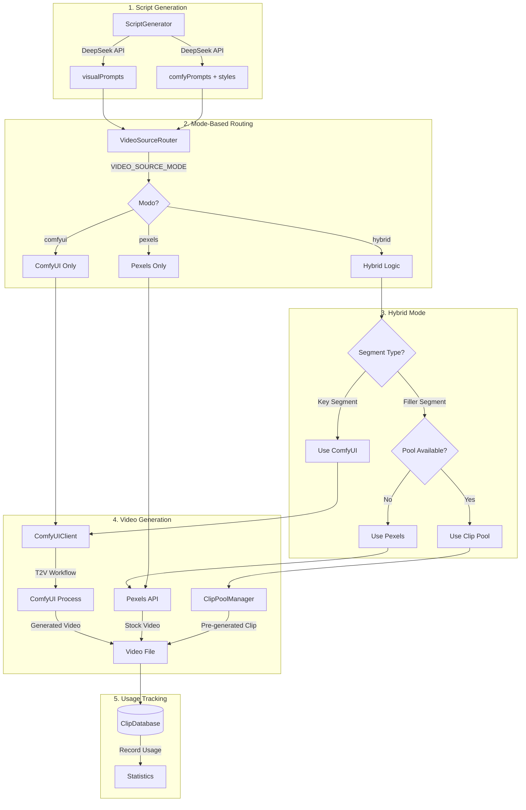

# Technical Design Document

## Overview

Este documento describe el diseño técnico para integrar generación de video con IA local mediante ComfyUI en OmniAI-Engine. El sistema soporta tres modos de operación configurables: 'comfyui' (solo generación local con GPU), 'pexels' (solo videos de stock para servidores sin GPU), y 'hybrid' (ComfyUI como primario con Pexels como fallback).

### Objetivos Principales

1. **Generación de Video Local**: Producir videos únicos usando modelos Wan 2.2/2.1 en ComfyUI con RTX 4060 8GB
2. **Gestión Automática de Procesos**: Iniciar, monitorear y reiniciar ComfyUI automáticamente
3. **Modos Flexibles**: Soportar operación exclusiva de ComfyUI, Pexels, o híbrida según el contexto
4. **Resiliencia**: Fallback inteligente entre fuentes de video para máxima disponibilidad
5. **Pool de Clips**: Pre-generación nocturna de clips genéricos para reducir tiempos de producción
6. **Auditoría Completa**: Base de datos SQLite para control total de clips y usos

### Contexto Técnico

- **Sistema Operativo**: Windows 11
- **GPU**: NVIDIA RTX 4060 8GB VRAM (modo --lowvram)
- **ComfyUI Path**: `D:\ComfyUI`
- **ComfyUI API**: `http://127.0.0.1:8188`
- **OmniAI-Engine Path**: `c:\Users\fogni\OneDrive\Escritorio\proyecto1a\OmniAI-Engine`

---

## Architecture

### Diagrama de Arquitectura de Alto Nivel

```
┌─────────────────────────────────────────────────────────────────────────────┐
│                              OmniAI-Engine                                   │
├─────────────────────────────────────────────────────────────────────────────┤
│                                                                              │
│  ┌─────────────────┐     ┌──────────────────┐     ┌───────────────────┐    │
│  │ ScriptGenerator │────▶│ VideoSourceRouter │────▶│   VideoRenderer   │    │
│  │ (DeepSeek API)  │     │  (Orchestrator)   │     │  (FFmpeg Merge)   │    │
│  └────────┬────────┘     └────────┬─────────┘     └───────────────────┘    │
│           │                       │                                          │
│           ▼                       ▼                                          │
│  ┌─────────────────┐     ┌──────────────────────────────────────────┐       │
│  │ visualPrompts[] │     │           Video Sources                   │       │
│  │ comfyPrompts[]  │     │  ┌──────────┐ ┌────────┐ ┌───────────┐   │       │
│  │ styles[]        │     │  │ComfyUI   │ │Pexels  │ │Clip Pool  │   │       │
│  └─────────────────┘     │  │Client    │ │API     │ │(Local DB) │   │       │
│                          │  └────┬─────┘ └───┬────┘ └─────┬─────┘   │       │
│                          └───────┼───────────┼────────────┼─────────┘       │
│                                  │           │            │                  │
│                                  ▼           │            ▼                  │
│                          ┌──────────────┐    │     ┌─────────────┐          │
│                          │ComfyUI       │    │     │ClipDatabase │          │
│                          │ProcessManager│    │     │(SQLite)     │          │
│                          └──────┬───────┘    │     └─────────────┘          │
│                                 │            │                               │
│                                 ▼            │                               │
│                          ┌──────────────┐    │                               │
│                          │HealthMonitor │    │                               │
│                          │(60s checks)  │    │                               │
│                          └──────────────┘    │                               │
│                                              │                               │
└──────────────────────────────────────────────┼───────────────────────────────┘
                                               │
                    ┌──────────────────────────┼──────────────────────────┐
                    │                          │                          │
                    ▼                          ▼                          ▼
            ┌──────────────┐          ┌──────────────┐          ┌──────────────┐
            │   ComfyUI    │          │  Pexels API  │          │ Synthetic    │
            │  (localhost) │          │  (External)  │          │ (FFmpeg)     │
            │   :8188      │          │              │          │              │
            └──────────────┘          └──────────────┘          └──────────────┘
```

### Flujo de Datos por Modo



---

## Components and Interfaces

### Nuevos Componentes

#### 1. ComfyUIProcessManager

**Responsabilidad**: Gestionar el ciclo de vida del proceso ComfyUI (inicio, monitoreo, reinicio automático).

**Ubicación**: `src/generators/ComfyUIProcessManager.ts`

```typescript
import { ChildProcess } from 'child_process';
import { EventEmitter } from 'events';

/** Eventos emitidos por el ProcessManager */
export interface ProcessManagerEvents {
    'process:started': () => void;
    'process:stopped': () => void;
    'process:crashed': (exitCode: number | null) => void;
    'process:restarted': (attempt: number) => void;
    'startup:timeout': () => void;
}

/** Estado del proceso ComfyUI */
export type ProcessState = 'stopped' | 'starting' | 'running' | 'crashed' | 'unavailable';

/** Configuración del ProcessManager */
export interface ProcessManagerConfig {
    /** Ruta al script de inicio (default: D:\ComfyUI\start_comfyui.bat) */
    startScript: string;
    /** URL base de ComfyUI para verificar disponibilidad */
    comfyUrl: string;
    /** Timeout de startup en ms (default: 120000) */
    startupTimeoutMs: number;
    /** Intervalo de verificación durante startup en ms (default: 5000) */
    startupPollIntervalMs: number;
    /** Máximo de reintentos automáticos ante crash (default: 3) */
    maxRestartAttempts: number;
    /** Modo de video configurado */
    videoSourceMode: VideoSourceMode;
}

export class ComfyUIProcessManager extends EventEmitter {
    private process: ChildProcess | null = null;
    private state: ProcessState = 'stopped';
    private restartAttempts: number = 0;
    private hasPendingGenerations: boolean = false;
    
    constructor(config: Partial<ProcessManagerConfig>);
    
    /** Inicia el proceso ComfyUI si no está corriendo */
    public async start(): Promise<boolean>;
    
    /** Detiene el proceso ComfyUI gracefully */
    public async shutdown(): Promise<void>;
    
    /** Obtiene el estado actual del proceso */
    public getState(): ProcessState;
    
    /** Marca si hay generaciones pendientes (para decidir restart) */
    public setPendingGenerations(pending: boolean): void;
    
    /** Verifica si ComfyUI ya está corriendo */
    private async checkIfRunning(): Promise<boolean>;
    
    /** Espera a que ComfyUI esté disponible */
    private async waitForStartup(): Promise<boolean>;
    
    /** Handler para cuando el proceso termina */
    private handleProcessExit(code: number | null): void;
}
```

#### 2. ComfyUIHealthMonitor

**Responsabilidad**: Monitorear la salud de ComfyUI con health checks periódicos y emitir eventos de cambio de estado.

**Ubicación**: `src/generators/ComfyUIHealthMonitor.ts`

```typescript
import { EventEmitter } from 'events';

/** Eventos emitidos por el HealthMonitor */
export interface HealthMonitorEvents {
    'comfyui:available': () => void;
    'comfyui:unavailable': () => void;
    'health:check': (metrics: HealthMetrics) => void;
}

/** Métricas de salud de ComfyUI */
export interface HealthMetrics {
    /** VRAM disponible en MB */
    vramAvailableMB: number;
    /** VRAM total en MB */
    vramTotalMB: number;
    /** Porcentaje de VRAM usado */
    vramUsagePercent: number;
    /** Número de jobs en cola */
    queuePending: number;
    /** Número de jobs ejecutándose */
    queueRunning: number;
    /** Timestamp del health check */
    timestamp: Date;
}

/** Configuración del HealthMonitor */
export interface HealthMonitorConfig {
    /** URL base de ComfyUI */
    comfyUrl: string;
    /** Intervalo entre health checks en ms (default: 60000) */
    checkIntervalMs: number;
    /** Número de fallos consecutivos para marcar unavailable (default: 3) */
    failureThreshold: number;
    /** Timeout para cada health check en ms (default: 5000) */
    checkTimeoutMs: number;
}

export class ComfyUIHealthMonitor extends EventEmitter {
    private isAvailable: boolean = false;
    private consecutiveFailures: number = 0;
    private checkInterval: NodeJS.Timeout | null = null;
    private latestMetrics: HealthMetrics | null = null;
    
    constructor(config: Partial<HealthMonitorConfig>);
    
    /** Inicia el monitoreo periódico */
    public start(): void;
    
    /** Detiene el monitoreo */
    public stop(): void;
    
    /** Realiza un health check inmediato */
    public async checkNow(): Promise<HealthMetrics | null>;
    
    /** Obtiene el estado de disponibilidad actual */
    public isComfyUIAvailable(): boolean;
    
    /** Obtiene las últimas métricas registradas */
    public getLatestMetrics(): HealthMetrics | null;
    
    /** Ejecuta el health check contra /system_stats */
    private async performHealthCheck(): Promise<HealthMetrics | null>;
    
    /** Actualiza el estado y emite eventos si cambia */
    private updateAvailability(available: boolean): void;
}
```

#### 3. ModelConfig

**Responsabilidad**: Configuración de modelos Wan y resoluciones según variables de entorno.

**Ubicación**: `src/generators/ModelConfig.ts`

```typescript
/** Tipos de modelo Wan soportados */
export type WanModelType = 'wan22_5B' | 'wan21_1_3B';

/** Estilos visuales para generación ComfyUI */
export type VisualStyle = 'cinemagraph_plotagraph' | 'moody_lofi_ambient' | 'analog_horror_liminal';

/** Modo de fuente de video */
export type VideoSourceMode = 'comfyui' | 'pexels' | 'hybrid';

/** Tipo de video */
export type VideoType = 'short' | 'long';

/** Configuración de archivos de un modelo */
export interface ModelFiles {
    unetModel: string;
    clipModel: string;
    vaeModel: string;
}

/** Preset de calidad */
export interface QualityPreset {
    name: string;
    width: number;
    height: number;
    frames: number;
    steps: number;
    cfg: number;
}

/** Parámetros específicos por estilo visual */
export interface StyleParams {
    frames: number;
    motionType: 'minimal' | 'atmospheric' | 'slow_unsettling';
    stabilityHigh: boolean;
    promptSuffix: string;
}

/** Resolución de video */
export interface Resolution {
    width: number;
    height: number;
}

/** Configuración completa del modelo */
export interface ModelConfiguration {
    modelType: WanModelType;
    files: ModelFiles;
    presets: Record<string, QualityPreset>;
    styleParams: Record<VisualStyle, StyleParams>;
    shortResolution: Resolution;
    longResolution: Resolution;
    defaultFrames: number;
}

export class ModelConfig {
    private static instance: ModelConfig | null = null;
    private config: ModelConfiguration;
    
    private constructor();
    
    /** Obtiene la instancia singleton */
    public static getInstance(): ModelConfig;
    
    /** Obtiene la configuración completa */
    public getConfig(): ModelConfiguration;
    
    /** Obtiene los archivos del modelo configurado */
    public getModelFiles(): ModelFiles;
    
    /** Obtiene un preset de calidad por nombre */
    public getPreset(presetName: string): QualityPreset;
    
    /** Obtiene la resolución para un tipo de video */
    public getResolution(videoType: VideoType): Resolution;
    
    /** Obtiene los parámetros de un estilo visual */
    public getStyleParams(style: VisualStyle): StyleParams;
    
    /** Valida que las dimensiones sean múltiplos de 16 */
    private validateResolution(resolution: Resolution, name: string): void;
    
    /** Parsea una resolución desde string "WIDTHxHEIGHT" */
    private parseResolution(resolutionStr: string): Resolution;
    
    /** Valida el modo de fuente de video */
    public static validateVideoSourceMode(mode: string): VideoSourceMode;
}

/** Definición de archivos por modelo */
export const MODEL_FILES: Record<WanModelType, ModelFiles> = {
    wan22_5B: {
        unetModel: 'wan2.2_ti2v_5B_fp16.safetensors',
        clipModel: 'umt5_xxl_fp8_e4m3fn_scaled.safetensors',
        vaeModel: 'wan2.2_vae.safetensors'
    },
    wan21_1_3B: {
        unetModel: 'wan2.1_t2v_1.3B.safetensors',
        clipModel: 'umt5-xxl-enc-fp8_e4m3fn.safetensors',
        vaeModel: 'Wan2_1_VAE_bf16.safetensors'
    }
};

/** Parámetros por estilo visual */
export const STYLE_PARAMS: Record<VisualStyle, StyleParams> = {
    cinemagraph_plotagraph: {
        frames: 33,
        motionType: 'minimal',
        stabilityHigh: true,
        promptSuffix: 'subtle motion, gentle drift, seamless loop, static camera with minimal motion'
    },
    moody_lofi_ambient: {
        frames: 49,
        motionType: 'atmospheric',
        stabilityHigh: false,
        promptSuffix: 'slow movement, atmospheric drift, lo-fi aesthetic, seamless loop'
    },
    analog_horror_liminal: {
        frames: 49,
        motionType: 'slow_unsettling',
        stabilityHigh: false,
        promptSuffix: 'slow movement, static camera, liminal space, unsettling calm'
    }
};
```

#### 4. VideoSourceRouter

**Responsabilidad**: Orquestar la selección de fuente de video según el modo configurado y el tipo de segmento.

**Ubicación**: `src/generators/VideoSourceRouter.ts`

```typescript
import { ComfyUIClient, VideoGenerationResult as ComfyResult } from './ComfyUIClient';
import { ClipPoolManager } from './ClipPoolManager';
import { ClipDatabase } from './ClipDatabase';
import { VideoSourceMode, VisualStyle, VideoType } from './ModelConfig';

/** Tipo de segmento en el video */
export type SegmentType = 'key' | 'filler';

/** Resultado de generación unificado */
export interface VideoGenerationResult {
    /** Ruta al archivo de video generado */
    outputPath: string;
    /** Fuente utilizada para generar el video */
    sourceUsed: 'comfyui' | 'pexels' | 'synthetic' | 'pool';
    /** Tiempo de generación en segundos */
    generationTimeSeconds: number;
    /** ID del clip si se usó del pool */
    clipId?: string;
    /** Estilo visual si se generó con ComfyUI */
    style?: VisualStyle;
    /** Prompt utilizado */
    prompt: string;
}

/** Solicitud de generación de video */
export interface VideoGenerationRequest {
    /** Prompt para Pexels (keywords cortos) */
    visualPrompt: string;
    /** Prompt para ComfyUI (descripción detallada) */
    comfyPrompt?: string;
    /** Estilo visual para ComfyUI */
    style?: VisualStyle;
    /** Tipo de video (short o long) */
    videoType: VideoType;
    /** Tipo de segmento (key o filler) */
    segmentType?: SegmentType;
    /** ID del video para tracking */
    videoId: string;
    /** Índice del segmento en el video */
    segmentIndex: number;
    /** Duración deseada en segundos */
    durationSeconds?: number;
}

/** Configuración del router */
export interface VideoSourceRouterConfig {
    /** Modo de fuente de video */
    mode: VideoSourceMode;
    /** Cliente ComfyUI */
    comfyClient: ComfyUIClient;
    /** Manager del pool de clips */
    clipPoolManager: ClipPoolManager;
    /** Base de datos de clips */
    clipDatabase: ClipDatabase;
    /** API key de Pexels */
    pexelsApiKey: string;
}

export class VideoSourceRouter {
    private mode: VideoSourceMode;
    private comfyClient: ComfyUIClient;
    private clipPoolManager: ClipPoolManager;
    private clipDatabase: ClipDatabase;
    
    constructor(config: VideoSourceRouterConfig);
    
    /** Genera un video según el modo y tipo de segmento */
    public async generateVideo(request: VideoGenerationRequest): Promise<VideoGenerationResult>;
    
    /** Genera múltiples videos para un video largo */
    public async generateMultipleVideos(requests: VideoGenerationRequest[]): Promise<VideoGenerationResult[]>;
    
    /** Clasifica un segmento como key o filler */
    public classifySegment(segmentIndex: number, totalSegments: number, durationSeconds: number): SegmentType;
    
    /** Genera con ComfyUI */
    private async generateWithComfyUI(request: VideoGenerationRequest): Promise<VideoGenerationResult>;
    
    /** Genera con Pexels */
    private async generateWithPexels(request: VideoGenerationRequest): Promise<VideoGenerationResult>;
    
    /** Genera video sintético con FFmpeg */
    private async generateSynthetic(request: VideoGenerationRequest): Promise<VideoGenerationResult>;
    
    /** Obtiene un clip del pool */
    private async getFromPool(request: VideoGenerationRequest): Promise<VideoGenerationResult | null>;
    
    /** Registra el uso de un clip en la base de datos */
    private async trackUsage(result: VideoGenerationResult, request: VideoGenerationRequest): Promise<void>;
}
```

#### 5. ClipPoolManager

**Responsabilidad**: Gestionar el pool de clips pre-generados, incluyendo pre-generación nocturna y selección inteligente.

**Ubicación**: `src/generators/ClipPoolManager.ts`

```typescript
import { ClipDatabase, Clip, ClipCategory } from './ClipDatabase';
import { ComfyUIClient } from './ComfyUIClient';

/** Horario de pre-generación */
export interface PreGenerationSchedule {
    startHour: number;
    startMinute: number;
    endHour: number;
    endMinute: number;
}

/** Configuración del ClipPoolManager */
export interface ClipPoolManagerConfig {
    /** Directorio del pool de clips */
    poolDirectory: string;
    /** Horario de pre-generación (default: 02:00-06:00) */
    schedule: PreGenerationSchedule;
    /** Mínimo de clips por categoría (default: 20) */
    minClipsPerCategory: number;
    /** Categorías de clips a generar */
    categories: ClipCategory[];
    /** Cliente ComfyUI */
    comfyClient: ComfyUIClient;
    /** Base de datos de clips */
    database: ClipDatabase;
}

/** Estadísticas del pool */
export interface PoolStatistics {
    totalClips: number;
    clipsByCategory: Record<ClipCategory, number>;
    activeClips: number;
    retiredClips: number;
    lowCategories: ClipCategory[];
}

export class ClipPoolManager {
    private config: ClipPoolManagerConfig;
    private scheduledTask: NodeJS.Timeout | null = null;
    private isGenerating: boolean = false;
    
    constructor(config: Partial<ClipPoolManagerConfig>);
    
    /** Inicia el scheduler de pre-generación */
    public startScheduler(): void;
    
    /** Detiene el scheduler */
    public stopScheduler(): void;
    
    /** Dispara pre-generación manual */
    public async triggerPreGeneration(): Promise<void>;
    
    /** Obtiene un clip del pool que coincida con la solicitud */
    public async getClip(category: ClipCategory, keywords: string[]): Promise<Clip | null>;
    
    /** Obtiene estadísticas del pool */
    public async getStatistics(): Promise<PoolStatistics>;
    
    /** Registra el uso de un clip */
    public async recordUsage(clipId: string, videoId: string, videoType: string, segmentType: string, platform?: string): Promise<void>;
    
    /** Verifica si estamos en horario de pre-generación */
    private isWithinSchedule(): boolean;
    
    /** Ejecuta la sesión de pre-generación */
    private async runPreGenerationSession(): Promise<void>;
    
    /** Genera un clip para una categoría */
    private async generateClipForCategory(category: ClipCategory): Promise<void>;
    
    /** Obtiene categorías que necesitan más clips */
    private async getLowCategories(): Promise<ClipCategory[]>;
}

/** Categorías genéricas de clips */
export const CLIP_CATEGORIES: ClipCategory[] = [
    'nature',
    'technology', 
    'business',
    'abstract',
    'lifestyle',
    'urban'
];

/** Prompts por defecto por categoría */
export const CATEGORY_PROMPTS: Record<ClipCategory, string[]> = {
    nature: [
        'serene forest with gentle wind moving leaves, soft sunlight filtering through trees, cinemagraph style',
        'calm ocean waves at sunset, warm golden light, slow motion water movement',
        'mountain landscape with subtle cloud movement, peaceful atmosphere'
    ],
    technology: [
        'abstract data visualization with glowing nodes, futuristic blue aesthetic, subtle particle movement',
        'close-up of circuit board with LED lights pulsing gently, tech aesthetic',
        'holographic interface with floating elements, sci-fi ambience'
    ],
    business: [
        'modern office space with soft ambient lighting, minimal movement',
        'city skyline at dusk with twinkling lights, urban business aesthetic',
        'professional workspace with warm lighting, calm productive atmosphere'
    ],
    abstract: [
        'flowing gradient colors with slow morphing shapes, meditative visual',
        'geometric patterns with subtle rotation, hypnotic minimal design',
        'particle cloud with gentle drift, abstract digital art'
    ],
    lifestyle: [
        'cozy coffee shop interior with steam rising from cup, warm ambience',
        'home office with plants, natural light, calm productive space',
        'bookshelf with soft lamp light, intellectual cozy atmosphere'
    ],
    urban: [
        'rainy city street at night, neon reflections on wet pavement, lo-fi mood',
        'empty corridor with flickering fluorescent lights, liminal space aesthetic',
        'pedestrian crossing at night, single distant figure, analog horror vibe'
    ]
};
```

#### 6. ClipDatabase

**Responsabilidad**: Almacenamiento SQLite para control de clips generados y tracking de uso.

**Ubicación**: `src/generators/ClipDatabase.ts`

```typescript
import Database from 'better-sqlite3';

/** Categorías de clips */
export type ClipCategory = 'nature' | 'technology' | 'business' | 'abstract' | 'lifestyle' | 'urban';

/** Estado de un clip */
export type ClipStatus = 'active' | 'retired' | 'deleted';

/** Registro de clip en la base de datos */
export interface Clip {
    id: string;
    filepath: string;
    prompt: string;
    negativePrompt?: string;
    modelUsed: string;
    presetUsed?: string;
    visualStyle?: string;
    generationTimeSeconds?: number;
    createdAt: Date;
    category: ClipCategory;
    tags: string[];
    resolution: string;
    frames: number;
    durationSeconds: number;
    videoType: 'short' | 'long';
    timesUsed: number;
    status: ClipStatus;
}

/** Registro de uso de clip */
export interface ClipUsage {
    id: number;
    clipId: string;
    videoId: string;
    videoType: 'short' | 'long';
    segmentType?: 'key' | 'filler';
    usedAt: Date;
    platform?: string;
}

/** Estadísticas del pool */
export interface ClipStatistics {
    totalClips: number;
    clipsByCategory: Record<ClipCategory, number>;
    clipsByStatus: Record<ClipStatus, number>;
    mostUsedClips: Array<{ clipId: string; timesUsed: number }>;
    unusedClips: number;
    averageUsage: number;
}

/** Configuración de la base de datos */
export interface ClipDatabaseConfig {
    /** Ruta al archivo SQLite (default: data/clips.db) */
    databasePath: string;
}

export class ClipDatabase {
    private db: Database.Database;
    
    constructor(config?: Partial<ClipDatabaseConfig>);
    
    /** Inicializa la base de datos y ejecuta migraciones */
    public async initialize(): Promise<void>;
    
    /** Inserta un nuevo clip */
    public async insertClip(clip: Omit<Clip, 'id' | 'createdAt' | 'timesUsed' | 'status'>): Promise<string>;
    
    /** Obtiene un clip por ID */
    public async getClip(id: string): Promise<Clip | null>;
    
    /** Obtiene clips no usados en los últimos N días */
    public async getClipsNotUsedSince(days: number): Promise<Clip[]>;
    
    /** Obtiene clips por categoría ordenados por menor uso */
    public async getClipsByCategory(category: ClipCategory, orderBy?: 'least_used' | 'newest'): Promise<Clip[]>;
    
    /** Obtiene clips activos que coincidan con keywords */
    public async findClipsByKeywords(keywords: string[], category?: ClipCategory): Promise<Clip[]>;
    
    /** Registra el uso de un clip */
    public async recordUsage(usage: Omit<ClipUsage, 'id' | 'usedAt'>): Promise<void>;
    
    /** Incrementa el contador de uso de un clip */
    public async incrementUsageCount(clipId: string): Promise<void>;
    
    /** Retira un clip (marca como retired) */
    public async retireClip(clipId: string): Promise<void>;
    
    /** Obtiene estadísticas del pool */
    public async getStatistics(): Promise<ClipStatistics>;
    
    /** Cuenta clips por categoría */
    public async countByCategory(): Promise<Record<ClipCategory, number>>;
    
    /** Cierra la conexión a la base de datos */
    public close(): void;
    
    /** Ejecuta migraciones de esquema */
    private runMigrations(): void;
}
```

### Modificaciones a Componentes Existentes

#### 1. ScriptGenerator (Modificación)

**Cambios Necesarios**:
- Agregar generación de `comfyPrompts[]` con estilos visuales
- Mantener `visualPrompts[]` para Pexels
- Validar correspondencia 1:1 entre arrays

```typescript
// Nuevas interfaces a agregar
export interface ComfyPrompt {
    prompt: string;
    style: VisualStyle;
}

// Interfaz VideoScript extendida
export interface VideoScript {
    title: string;
    description: string;
    tags: string[];
    hook?: string;
    spokenText: string;
    visualPrompts: string[];           // Para Pexels (1-3 palabras)
    comfyPrompts?: ComfyPrompt[];       // Para ComfyUI (20-50 palabras + estilo)
    chapters?: { time: string; title: string }[];
}

// Nuevo método privado para expandir prompts si DeepSeek no los genera
private static generateFallbackComfyPrompts(visualPrompts: string[]): ComfyPrompt[];

// Modificaciones al prompt de DeepSeek para solicitar ambos arrays
```

#### 2. ComfyUIClient (Modificación)

**Cambios Necesarios**:
- Usar ModelConfig para obtener archivos de modelo
- Soportar diferentes resoluciones según VideoType
- Aplicar parámetros de estilo visual

```typescript
// Métodos a modificar
public async generateT2V(
    config: VideoGenerationConfig,
    timeoutMs?: number,
    style?: VisualStyle  // Nuevo parámetro
): Promise<VideoGenerationResult>;

// Nuevo método para generar con estilo
private applyStyleParameters(
    config: VideoGenerationConfig, 
    style: VisualStyle
): VideoGenerationConfig;
```

#### 3. VideoRenderer (Modificación)

**Cambios Necesarios**:
- Integrar con VideoSourceRouter en lugar de llamar directamente a Pexels
- Mantener la lógica de concatenación y FFmpeg
- Soportar mezcla de fuentes (ComfyUI + Pexels + Pool)

```typescript
// Nuevo parámetro opcional para especificar fuente
public static async renderVideo(
    visualPrompts: string[], 
    comfyPrompts: ComfyPrompt[] | undefined,  // Nuevo
    audioFilename: string, 
    outputFilename: string, 
    text: string,
    videoId: string  // Nuevo, para tracking
): Promise<string>;
```

---

## Data Models

### Base de Datos SQLite

**Ubicación**: `data/clips.db`

#### Esquema

```sql
-- Tabla principal de clips generados
CREATE TABLE IF NOT EXISTS clips (
    id TEXT PRIMARY KEY,
    filepath TEXT NOT NULL UNIQUE,
    prompt TEXT NOT NULL,
    negative_prompt TEXT,
    model_used TEXT NOT NULL,
    preset_used TEXT,
    visual_style TEXT,
    generation_time_seconds REAL,
    created_at DATETIME DEFAULT CURRENT_TIMESTAMP,
    category TEXT NOT NULL,
    tags TEXT, -- JSON array serializado
    resolution TEXT NOT NULL,
    frames INTEGER NOT NULL,
    duration_seconds REAL NOT NULL,
    video_type TEXT NOT NULL CHECK (video_type IN ('short', 'long')),
    times_used INTEGER DEFAULT 0,
    status TEXT DEFAULT 'active' CHECK (status IN ('active', 'retired', 'deleted'))
);

-- Índices para búsquedas frecuentes
CREATE INDEX IF NOT EXISTS idx_clips_category ON clips(category);
CREATE INDEX IF NOT EXISTS idx_clips_status ON clips(status);
CREATE INDEX IF NOT EXISTS idx_clips_times_used ON clips(times_used);
CREATE INDEX IF NOT EXISTS idx_clips_created_at ON clips(created_at);

-- Tabla de registro de uso de clips
CREATE TABLE IF NOT EXISTS clip_usages (
    id INTEGER PRIMARY KEY AUTOINCREMENT,
    clip_id TEXT NOT NULL REFERENCES clips(id) ON DELETE CASCADE,
    video_id TEXT NOT NULL,
    video_type TEXT NOT NULL CHECK (video_type IN ('short', 'long')),
    segment_type TEXT CHECK (segment_type IN ('key', 'filler')),
    used_at DATETIME DEFAULT CURRENT_TIMESTAMP,
    platform TEXT
);

-- Índices para tracking de uso
CREATE INDEX IF NOT EXISTS idx_clip_usages_clip_id ON clip_usages(clip_id);
CREATE INDEX IF NOT EXISTS idx_clip_usages_used_at ON clip_usages(used_at);
CREATE INDEX IF NOT EXISTS idx_clip_usages_video_id ON clip_usages(video_id);

-- Tabla de migraciones aplicadas
CREATE TABLE IF NOT EXISTS migrations (
    id INTEGER PRIMARY KEY AUTOINCREMENT,
    name TEXT NOT NULL UNIQUE,
    applied_at DATETIME DEFAULT CURRENT_TIMESTAMP
);
```

### Variables de Entorno

**Archivo**: `.env`

```bash
# === VIDEO SOURCE CONFIGURATION ===
# Modo de fuente de video: 'comfyui' | 'pexels' | 'hybrid'
VIDEO_SOURCE_MODE=hybrid

# === COMFYUI CONFIGURATION ===
# Modelo Wan a usar: 'wan22_5B' | 'wan21_1_3B'
COMFYUI_MODEL=wan22_5B

# Ruta base de ComfyUI
COMFYUI_PATH=D:\ComfyUI

# URL de la API de ComfyUI
COMFYUI_URL=http://127.0.0.1:8188

# Resoluciones personalizadas (formato: WIDTHxHEIGHT, deben ser múltiplos de 16)
COMFYUI_SHORT_RESOLUTION=576x1024
COMFYUI_LONG_RESOLUTION=832x480

# Número de frames por defecto
COMFYUI_DEFAULT_FRAMES=49

# Timeout para generación en minutos
COMFYUI_GENERATION_TIMEOUT_MINUTES=30

# === CLIP POOL CONFIGURATION ===
# Horario de pre-generación nocturna (formato: HH:MM-HH:MM)
CLIP_PREGENERATION_SCHEDULE=02:00-06:00

# Mínimo de clips por categoría
CLIP_POOL_MIN_PER_CATEGORY=20

# Directorio del pool de clips
CLIP_POOL_DIRECTORY=content/clip_pool

# === EXISTING CONFIGURATION ===
PEXELS_API_KEY=your_pexels_api_key
DEEPSEEK_API_KEY=your_deepseek_api_key
```

### Estructuras de Datos Principales

```typescript
// Script con prompts duales
interface VideoScript {
    title: string;
    description: string;
    tags: string[];
    hook?: string;
    spokenText: string;
    visualPrompts: string[];      // ["technology", "brain neural", "coding"]
    comfyPrompts?: ComfyPrompt[]; // Descripciones detalladas con estilo
    chapters?: { time: string; title: string }[];
}

// ComfyPrompt con estilo visual
interface ComfyPrompt {
    prompt: string;  // 20-50 palabras describiendo escena, iluminación, movimiento
    style: VisualStyle;
}

// Resultado de generación unificado
interface VideoGenerationResult {
    outputPath: string;
    sourceUsed: 'comfyui' | 'pexels' | 'synthetic' | 'pool';
    generationTimeSeconds: number;
    clipId?: string;
    style?: VisualStyle;
    prompt: string;
}
```

---

## Correctness Properties

*A property is a characteristic or behavior that should hold true across all valid executions of a system-essentially, a formal statement about what the system should do. Properties serve as the bridge between human-readable specifications and machine-verifiable correctness guarantees.*

### Property 1: Modo de Video Determina Inicialización de ComfyUI

*For any* configuración de VIDEO_SOURCE_MODE:
- Cuando mode === 'pexels', el ComfyUI_Process_Manager NO debe intentar iniciar ComfyUI
- Cuando mode === 'comfyui' o 'hybrid', el ComfyUI_Process_Manager DEBE verificar disponibilidad e intentar iniciar si no está corriendo

**Validates: Requirements 1.1, 1.2, 8.6, 8.7**

### Property 2: Health Checks Consecutivos Fallidos Marcan Unavailable

*For any* secuencia de N health checks consecutivos donde N >= failureThreshold (default: 3):
- Si todos los checks fallan, el estado DEBE cambiar a 'unavailable'
- Si cualquier check tiene éxito, el contador de fallos consecutivos DEBE resetearse a 0
- Cuando el estado cambia de available a unavailable, DEBE emitirse el evento 'comfyui:unavailable'

**Validates: Requirements 2.3, 2.4, 2.5**

### Property 3: Configuración de Modelo Retorna Archivos Correctos

*For any* valor válido de COMFYUI_MODEL ('wan22_5B' o 'wan21_1_3B'):
- Los archivos retornados por getModelFiles() DEBEN corresponder exactamente a la definición de ese modelo
- Para 'wan22_5B': unetModel='wan2.2_ti2v_5B_fp16.safetensors', clipModel='umt5_xxl_fp8_e4m3fn_scaled.safetensors', vaeModel='wan2.2_vae.safetensors'
- Para 'wan21_1_3B': unetModel='wan2.1_t2v_1.3B.safetensors', clipModel='umt5-xxl-enc-fp8_e4m3fn.safetensors', vaeModel='Wan2_1_VAE_bf16.safetensors'

*For any* valor inválido de COMFYUI_MODEL, la inicialización DEBE lanzar un error descriptivo

**Validates: Requirements 3.3, 3.5, 3.7, 3.8**

### Property 4: Resolución Correcta Según Tipo de Video

*For any* solicitud de generación de video:
- Si videoType === 'short', la resolución DEBE ser portrait (width < height) con valores por defecto 576x1024
- Si videoType === 'long', la resolución DEBE ser landscape (width > height) con valores por defecto 832x480
- Todas las dimensiones (width y height) DEBEN ser múltiplos de 16

**Validates: Requirements 4.7, 4.8, 14.1, 14.2, 14.5**

### Property 5: Comportamiento de Fallback Según Modo

*For any* solicitud de generación de video y resultado de la fuente primaria:

**Modo 'comfyui':**
- Si ComfyUI falla, DEBE reintentar hasta 2 veces
- Si falla después de reintentos, DEBE lanzar error sin intentar alternativas

**Modo 'pexels':**
- Si Pexels falla, DEBE generar video sintético con FFmpeg
- NUNCA debe intentar usar ComfyUI

**Modo 'hybrid':**
- Si ComfyUI falla o no está disponible, DEBE usar Pexels automáticamente
- Si Pexels también falla, DEBE generar video sintético
- El resultado DEBE incluir sourceUsed indicando qué fuente se utilizó

**Validates: Requirements 5.1, 5.2, 5.3, 5.4, 5.5, 5.6, 5.7, 8.4, 8.5, 8.8, 8.9**

### Property 6: Clasificación de Segmentos Key/Filler

*For any* video con N segmentos y duración total D segundos:
- Los primeros segmentos que cubren los primeros 10 segundos DEBEN clasificarse como 'key'
- Los últimos segmentos que cubren los últimos 10 segundos DEBEN clasificarse como 'key'
- Los segmentos intermedios DEBEN clasificarse como 'filler'
- Si hay override manual via segment_type en metadata, ese valor DEBE tener precedencia

**Validates: Requirements 9.1, 9.2, 9.3, 9.4, 9.5, 9.6**

### Property 7: Selección de Pool Evita Repeticiones

*For any* solicitud de clip del pool:
- NO debe seleccionar clips usados en videos publicados en los últimos 7 días
- DEBE priorizar clips con menor times_used
- Si un clip tiene times_used > 10, DEBE ser marcado como 'retired' y excluido de selección
- El contador times_used DEBE incrementarse cada vez que se usa un clip

**Validates: Requirements 11.3, 11.6, 11.7**

### Property 8: Prompts Duales con Correspondencia 1:1

*For any* VideoScript generado por ScriptGenerator:
- Si comfyPrompts está presente, visualPrompts.length DEBE ser igual a comfyPrompts.length
- Cada visualPrompt[i] DEBE corresponder semánticamente con comfyPrompt[i]
- Si DeepSeek no retorna comfyPrompts, el sistema DEBE generar comfyPrompts básicos expandiendo visualPrompts

**Validates: Requirements 13.5, 13.6**

### Property 9: Estilos Visuales Contienen Elementos Requeridos

*For any* ComfyPrompt con estilo asignado:

**Estilo 'cinemagraph_plotagraph':**
- El prompt DEBE incluir indicador de escena mayormente estática
- DEBE incluir un elemento en movimiento sutil (humo, vapor, agua, parpadeo de luz, o partículas)
- DEBE incluir 'subtle motion', 'seamless loop', o 'static camera'

**Estilo 'moody_lofi_ambient':**
- El prompt DEBE incluir atmósfera acogedora pero melancólica
- DEBE incluir elementos atmosféricos (lluvia, niebla, neón difuso)
- DEBE incluir 'lo-fi aesthetic' o 'atmospheric'

**Estilo 'analog_horror_liminal':**
- El prompt DEBE describir espacio liminal perturbador
- DEBE incluir iluminación específica (fluorescente, parpadeante)
- DEBE incluir 'liminal space' o 'unsettling'

**Validates: Requirements 15.2, 15.3, 15.4, 15.7**

### Property 10: Workflow T2V Válido para Cualquier Configuración

*For any* configuración válida de VideoGenerationConfig:
- El workflow generado DEBE contener todos los nodos requeridos: UNETLoader, CLIPLoader, VAELoader, CLIPTextEncode (x2), WanImageToVideo, KSampler, VAEDecode, SaveAnimatedWEBP
- Las conexiones entre nodos DEBEN ser válidas (outputs conectados a inputs correctos)
- Los parámetros del KSampler DEBEN estar dentro de rangos válidos: steps >= 1, cfg >= 0, seed es entero

**Validates: Requirements 4.1**

---

## Error Handling

### Estrategia de Errores por Componente

#### ComfyUIProcessManager

| Error | Causa | Manejo | Recovery |
|-------|-------|--------|----------|
| `StartupTimeoutError` | ComfyUI no responde en 120s | Log error, marcar unavailable | Permitir continuar con Pexels en modo hybrid |
| `ProcessCrashError` | Proceso terminó inesperadamente | Detectar via evento 'exit', log | Auto-restart hasta 3 veces si hay generaciones pendientes |
| `SpawnError` | No se puede ejecutar start_comfyui.bat | Log error con path | Verificar que existe el script |

#### ComfyUIHealthMonitor

| Error | Causa | Manejo | Recovery |
|-------|-------|--------|----------|
| `HealthCheckTimeout` | /system_stats no responde | Incrementar contador de fallos | Reintentar hasta threshold |
| `NetworkError` | Conexión rechazada | Tratar como fallo de health | Emitir unavailable después de threshold |

#### ModelConfig

| Error | Causa | Manejo | Recovery |
|-------|-------|--------|----------|
| `InvalidModelError` | COMFYUI_MODEL inválido | Lanzar error descriptivo al inicio | Ninguno, requiere corrección de config |
| `InvalidResolutionError` | Resolución no múltiplo de 16 | Lanzar error descriptivo al inicio | Ninguno, requiere corrección de config |

#### VideoSourceRouter

| Error | Causa | Manejo | Recovery |
|-------|-------|--------|----------|
| `ComfyUIUnavailable` | ComfyUI no disponible | Según modo: error o fallback | Modo hybrid: usar Pexels |
| `PexelsApiError` | Pexels API falla | Reintentar con backoff | Fallback a video sintético |
| `GenerationTimeout` | Timeout de 30 minutos | Cancelar job, log warning | Usar fuente alternativa |
| `NoClipsAvailable` | Pool vacío para categoría | Log warning | Usar Pexels como fallback |

#### ClipDatabase

| Error | Causa | Manejo | Recovery |
|-------|-------|--------|----------|
| `DatabaseCorruption` | Archivo SQLite corrupto | Log error crítico | Recrear base de datos vacía |
| `MigrationError` | Migración de esquema falla | Log error, detener inicio | Requiere intervención manual |

### Códigos de Error

```typescript
export enum VideoGenerationErrorCode {
    // ComfyUI Process Errors (1xxx)
    COMFYUI_STARTUP_TIMEOUT = 1001,
    COMFYUI_PROCESS_CRASH = 1002,
    COMFYUI_SPAWN_FAILED = 1003,
    
    // Health Monitor Errors (2xxx)
    COMFYUI_UNAVAILABLE = 2001,
    HEALTH_CHECK_FAILED = 2002,
    
    // Configuration Errors (3xxx)
    INVALID_MODEL_CONFIG = 3001,
    INVALID_RESOLUTION = 3002,
    INVALID_VIDEO_SOURCE_MODE = 3003,
    
    // Generation Errors (4xxx)
    GENERATION_TIMEOUT = 4001,
    WORKFLOW_FAILED = 4002,
    OUTPUT_NOT_FOUND = 4003,
    
    // Pexels Errors (5xxx)
    PEXELS_API_ERROR = 5001,
    PEXELS_NO_RESULTS = 5002,
    
    // Pool Errors (6xxx)
    NO_CLIPS_AVAILABLE = 6001,
    CLIP_NOT_FOUND = 6002,
    
    // Database Errors (7xxx)
    DATABASE_ERROR = 7001,
    MIGRATION_FAILED = 7002
}

export class VideoGenerationError extends Error {
    constructor(
        public code: VideoGenerationErrorCode,
        message: string,
        public recoverable: boolean = false,
        public context?: Record<string, unknown>
    ) {
        super(message);
        this.name = 'VideoGenerationError';
    }
}
```

### Logging de Errores

Todos los errores deben loguearse con:
- Código de error
- Mensaje descriptivo
- Contexto relevante (prompt, modo, configuración)
- Stack trace para errores no esperados
- Correlation ID del pipeline

---

## Testing Strategy

### Enfoque de Testing Dual

Este feature requiere una combinación de:
1. **Unit Tests**: Para lógica de negocio pura y validaciones
2. **Property-Based Tests**: Para verificar propiedades universales que deben sostenerse
3. **Integration Tests**: Para interacciones con ComfyUI, base de datos y APIs externas

### Unit Tests (Example-Based)

#### ComfyUIProcessManager
- Test: Inicialización omitida cuando modo es 'pexels'
- Test: Llamada a checkIfRunning antes de spawn
- Test: Timeout de 120 segundos con polling cada 5 segundos
- Test: Handler de evento 'exit' registra correctamente
- Test: shutdown() termina proceso gracefully

#### ComfyUIHealthMonitor
- Test: Intervalo de health check es 60 segundos
- Test: Endpoint /system_stats es consultado
- Test: Emisión de evento comfyui:unavailable en transición
- Test: Emisión de evento comfyui:available en recovery
- Test: Métricas VRAM y cola se registran en log

#### ModelConfig
- Test: Lectura de COMFYUI_MODEL desde .env
- Test: Valor por defecto 'wan22_5B' sin variable
- Test: Log de configuración al iniciar
- Test: Presets de calidad con parámetros correctos

### Property-Based Tests

**Biblioteca**: `fast-check` (TypeScript)

**Configuración**: Mínimo 100 iteraciones por test

```typescript
// Ejemplo de estructura de test con property-based testing
import fc from 'fast-check';

describe('ModelConfig Properties', () => {
    // Feature: comfyui-video-generation, Property 3: Configuración de Modelo Retorna Archivos Correctos
    it('should return correct model files for any valid model type', () => {
        const validModels = fc.constantFrom('wan22_5B', 'wan21_1_3B');
        
        fc.assert(
            fc.property(validModels, (modelType) => {
                const config = new ModelConfig({ model: modelType });
                const files = config.getModelFiles();
                
                // Verificar que los archivos corresponden al modelo
                if (modelType === 'wan22_5B') {
                    expect(files.unetModel).toBe('wan2.2_ti2v_5B_fp16.safetensors');
                } else {
                    expect(files.unetModel).toBe('wan2.1_t2v_1.3B.safetensors');
                }
            }),
            { numRuns: 100 }
        );
    });
    
    // Feature: comfyui-video-generation, Property 3: Valores inválidos lanzan error
    it('should throw error for any invalid model type', () => {
        const invalidModels = fc.string().filter(s => s !== 'wan22_5B' && s !== 'wan21_1_3B');
        
        fc.assert(
            fc.property(invalidModels, (modelType) => {
                expect(() => new ModelConfig({ model: modelType })).toThrow();
            }),
            { numRuns: 100 }
        );
    });
});

describe('Resolution Properties', () => {
    // Feature: comfyui-video-generation, Property 4: Resolución Correcta Según Tipo de Video
    it('should return portrait resolution for short videos', () => {
        const videoTypes = fc.constantFrom('short', 'long');
        
        fc.assert(
            fc.property(videoTypes, (videoType) => {
                const config = ModelConfig.getInstance();
                const resolution = config.getResolution(videoType);
                
                if (videoType === 'short') {
                    expect(resolution.width).toBeLessThan(resolution.height);
                } else {
                    expect(resolution.width).toBeGreaterThan(resolution.height);
                }
                
                // Múltiplos de 16
                expect(resolution.width % 16).toBe(0);
                expect(resolution.height % 16).toBe(0);
            }),
            { numRuns: 100 }
        );
    });
});

describe('VideoSourceRouter Fallback Properties', () => {
    // Feature: comfyui-video-generation, Property 5: Comportamiento de Fallback Según Modo
    it('should follow correct fallback chain for any mode and failure scenario', () => {
        const modes = fc.constantFrom('comfyui', 'pexels', 'hybrid');
        const comfyAvailable = fc.boolean();
        const pexelsAvailable = fc.boolean();
        
        fc.assert(
            fc.property(modes, comfyAvailable, pexelsAvailable, (mode, comfyOk, pexelsOk) => {
                const result = simulateFallbackBehavior(mode, comfyOk, pexelsOk);
                
                if (mode === 'pexels') {
                    expect(result.attemptedComfyUI).toBe(false);
                }
                
                if (mode === 'comfyui' && !comfyOk) {
                    expect(result.threwError).toBe(true);
                }
                
                if (mode === 'hybrid') {
                    if (!comfyOk && !pexelsOk) {
                        expect(result.sourceUsed).toBe('synthetic');
                    } else if (!comfyOk) {
                        expect(result.sourceUsed).toBe('pexels');
                    }
                }
            }),
            { numRuns: 100 }
        );
    });
});

describe('Clip Pool Properties', () => {
    // Feature: comfyui-video-generation, Property 7: Selección de Pool Evita Repeticiones
    it('should not select clips used in last 7 days', () => {
        const clipWithRecentUsage = fc.record({
            id: fc.uuid(),
            lastUsedDaysAgo: fc.integer({ min: 0, max: 6 })
        });
        
        fc.assert(
            fc.property(fc.array(clipWithRecentUsage, { minLength: 1 }), (clips) => {
                const selectedClip = selectFromPool(clips);
                
                // Si hay clips sin uso reciente, debe seleccionar uno de esos
                const oldClips = clips.filter(c => c.lastUsedDaysAgo > 7);
                if (oldClips.length > 0 && selectedClip) {
                    expect(selectedClip.lastUsedDaysAgo).toBeGreaterThan(7);
                }
            }),
            { numRuns: 100 }
        );
    });
});

describe('Segment Classification Properties', () => {
    // Feature: comfyui-video-generation, Property 6: Clasificación de Segmentos Key/Filler
    it('should classify intro and outro as key segments', () => {
        const segmentPosition = fc.record({
            index: fc.integer({ min: 0, max: 20 }),
            totalSegments: fc.integer({ min: 1, max: 20 }),
            segmentDuration: fc.integer({ min: 3, max: 15 }),
            totalDuration: fc.integer({ min: 30, max: 600 })
        });
        
        fc.assert(
            fc.property(segmentPosition, ({ index, totalSegments, segmentDuration, totalDuration }) => {
                if (index >= totalSegments) return true; // Skip invalid
                
                const startTime = (index / totalSegments) * totalDuration;
                const endTime = ((index + 1) / totalSegments) * totalDuration;
                
                const classification = classifySegment(index, totalSegments, totalDuration);
                
                // First 10 seconds = key
                if (startTime < 10) {
                    expect(classification).toBe('key');
                }
                // Last 10 seconds = key
                if (endTime > totalDuration - 10) {
                    expect(classification).toBe('key');
                }
            }),
            { numRuns: 100 }
        );
    });
});
```

### Integration Tests

#### ComfyUI Integration
- Test: Conexión real a ComfyUI cuando está disponible
- Test: Envío de workflow y recepción de resultado
- Test: Timeout y cancelación de jobs

#### ClipDatabase Integration
- Test: Creación de tablas y migraciones
- Test: CRUD completo de clips
- Test: Queries de búsqueda por categoría y keywords
- Test: Tracking de uso y estadísticas

#### End-to-End Tests
- Test: Pipeline completo Short con modo hybrid
- Test: Pipeline completo Long Video con múltiples clips
- Test: Pre-generación nocturna de clips

### Cobertura Mínima Requerida

| Componente | Unit | Property | Integration |
|------------|------|----------|-------------|
| ComfyUIProcessManager | 80% | N/A | 60% |
| ComfyUIHealthMonitor | 80% | 100% (P2) | 50% |
| ModelConfig | 90% | 100% (P3, P4) | N/A |
| VideoSourceRouter | 80% | 100% (P5, P6) | 70% |
| ClipPoolManager | 70% | 100% (P7) | 60% |
| ClipDatabase | 60% | N/A | 90% |
| ScriptGenerator (mod) | 70% | 100% (P8, P9) | 50% |

### Comandos de Test

```bash
# Ejecutar todos los tests
npm test

# Ejecutar solo property tests
npm test -- --grep "Properties"

# Ejecutar tests de integración
npm test -- --grep "Integration"

# Ejecutar tests con cobertura
npm test -- --coverage

# Ejecutar tests de un componente específico
npm test -- --grep "ModelConfig"
```
