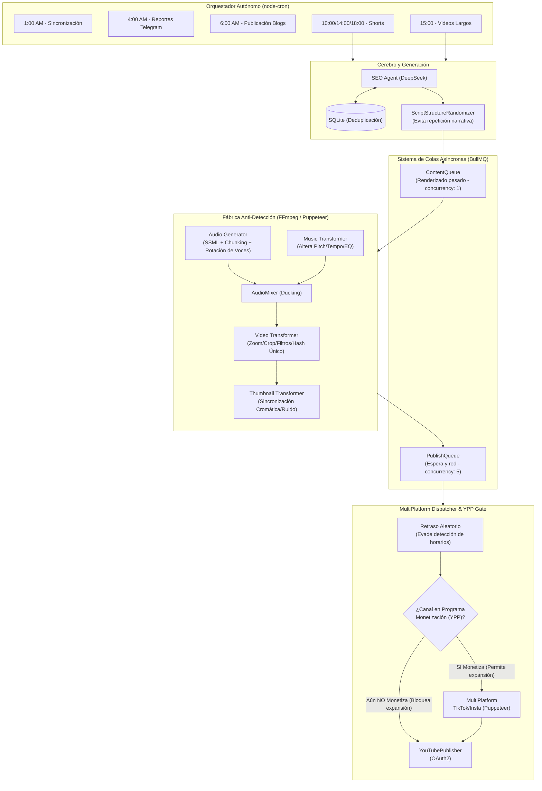

# OmniAI-Engine

🚀 **Autopilot Content Factory & SEO Master (Autismo e Inteligencia Artificial)**

OmniAI-Engine es un motor de Inteligencia Artificial totalmente autónomo diseñado para generar y distribuir contenido sin intervención humana. Enfocado 100% en el nicho de **Autismo e Inteligencia Artificial**, construido como el nodo hijo creativo y de marketing del ecosistema `autonomous-income-node`.

**Canal de YouTube:** [NeuroSync AI](https://www.youtube.com/@NeuroSyncAI)

## Características Principales

- **SEO Agent (El Estratega y Bucle de Retroalimentación):** Analiza el rendimiento histórico de videos/blogs almacenado en una base de datos local SQLite (`content/database.sqlite`), detecta tendencias de interacción bajo barreras estrictas del nicho (**Autismo e IA**), y genera temas virales, títulos, 15-20 palabras clave y recomendaciones de frecuencia dinámicas usando DeepSeek. Incluye **deduplicación de temas** para evitar repetir contenido.
- **Analytics Engine (El Científico):** Se conecta a la API de Datos de YouTube v3 para obtener conteo de suscriptores, vistas de videos y likes en tiempo real, retroalimentando al SEO Agent.
- **Script & Blog Generators (Los Escritores):** Escribe cortos atractivos de 60s, documentales de 5m y artículos markdown de más de 1000 palabras sobre Inteligencia Artificial y Neurodiversidad.
- **Audio Generator (La Voz):** Usa Google Cloud TTS para voces superpuestas con **división automática de texto (chunking)** para manejar guiones que exceden el límite de 5000 bytes de la API.
- **Video Renderer (El Estudio):** Obtiene material de video de archivo de Pexels (con resiliencia de búsqueda de respaldo) y renderiza videos en 1080p con FFmpeg. **NUEVO:** Integración con `VideoSourceRouter` para múltiples fuentes de video.
- **ComfyUI Video Generation (El Artista IA):** Genera videos con IA local usando **ComfyUI con modelos Wan 2.2**. Incluye:
  - **T2V (Text-to-Video):** Generación desde texto para pool de clips
  - **I2V (Image-to-Video):** Anima imágenes para segmentos KEY (intro/outro) con control visual preciso
  - **VideoSourceRouter:** Modo `hybrid` (ComfyUI para KEY, Pool/Pexels para FILLER)
  - **ClipPoolManager:** Pool de clips pre-generados en 6 categorías
  - **3 estilos visuales:** `cinemagraph_plotagraph`, `moody_lofi_ambient`, `analog_horror_liminal`
  - **Pollinations.ai Fallback:** API gratuita sin límites para imágenes
- **Cambios de Seguridad (Agosto 2026):**
  - **Glitch RGB (0.5s):** Reemplaza strobing epiléptico de 3s. Efecto de aberración cromática 100% seguro.
  - **Formant Shift:** Reemplaza `atempo=1.02`. Altera timbre de voz sin cambiar velocidad, indetectable por YouTube.
- **Thumbnail Generator:** Crea miniaturas personalizadas con prompts visuales para un mejor CTR.
- **Multi-Platform Publishers (Los Distribuidores):** 
  - **YouTube:** Subida con OAuth2 y **sanitización de etiquetas (tags)** para cumplimiento de la API.
  - **Plataformas de Blog:** Envío simultáneo a **Hashnode**, **Medium** y **Dev.to** (Actualmente pausado bajo demanda mediante bandera `ENABLE_BLOG_PUBLISHING=false` en el archivo `.env` por estrictas políticas de detección de bots en Hashnode/Medium).
- **Autonomous Orchestrator (El Cerebro):** Programador maestro Cron que coordina toda la fábrica (ver Calendario abajo).
- **Telegram Reporter:** Notificaciones push en vivo incluyendo reportes diarios de analíticas.
- **YPP Validation Gate:** Puerta estricta de monetización que bloquea automáticamente la expansión hacia TikTok, Instagram Reels o un tercer canal hasta que el canal de YouTube reciba su primer dólar (`hasFirstDollar === true`). Las integraciones multiplataforma (TikTokPublisher / InstagramPublisher con Puppeteer Stealth) están 100% funcionales y a la espera de desbloqueo de esta regla de oro.
- **YouTube Analytics API v2:** Integración real (sin mocks) que lee suscriptores, total de horas visualizadas y retención para verificar automáticamente si se aprueban las puertas YPP.
- **Anti-Detección y Humanización:** Transformadores de video/miniatura/música y aleatorizadores de estructura de guion para evadir detección y Content ID.

## Flujo del Sistema y Mecanismos Anti-Detección

El siguiente diagrama detalla cómo se orquesta la aplicación, cómo fluye la información paso a paso, y las **capas de anti-detección** (Fábrica Anti-Detección) diseñadas para evitar bloqueos por parte del algoritmo de YouTube y Content ID.



### Por qué era necesaria esta arquitectura (Auditoría Anti-Detección)

Tras una auditoría exhaustiva del sistema original, se detectó que el algoritmo de YouTube identificaba el canal como "contenido automatizado", lo que reducía el alcance orgánico. Para resolver estos problemas, la **V2** introdujo el sistema mostrado arriba:

1. **Evasión de Horarios Robóticos (Colas BullMQ Asíncronas):** El sistema anterior publicaba a horas fijas exactas (ej. 10:00 AM). YouTube penaliza este comportamiento robótico. Ahora, aunque el orquestador se active a las 10:00 AM y renderice el video en la **`ContentQueue`**, la publicación real se envía a la **`PublishQueue`** con el **`MultiPlatformDispatcher`** aplicando un **retraso aleatorio (de 0 a 45 minutos)**. Así, el video se publicará a horas impredecibles (ej. 10:23 AM o 10:41 AM), simulando el comportamiento de un humano presionando "Publicar", sin bloquear el servidor.
2. **Evasión de Huellas Visuales (Contenido Reutilizado):** Anteriormente, los videos e imágenes (o GIFs) obtenidos de Pexels se unían tal cual con el guion del SEO. YouTube tiene identificados esos archivos exactos (hashes). La solución es el **`Video Transformer`**, que altera dinámicamente cada clip (zoom, crop, filtros sutiles) y le asigna un Hash Único en los metadatos antes de pasarlo al `Video Renderer`. El **`Thumbnail Transformer`** hace exactamente lo mismo (sincronizando el ruido y el cromatismo) para las miniaturas.
3. **Evasión de Huellas de Audio y Voz AI:** Las voces generadas por IA también son detectables y la música gratuita sufre ataques de Content ID. 
   - El **`Audio Generator`** ahora implementa SSML para humanizar las pausas y tono, divide textos grandes en trozos pequeños (*Chunking*), y aplica una **Rotación Aleatoria de Voces Premium** (Neural2/Chirp/Journey) para que cada video suene con un locutor distinto y evite huellas acústicas repetitivas.
   - El **`Music Transformer`** altera aleatoriamente el Pitch, Tempo y Ecualización (EQ) de la música de fondo.
   - Ambos fluyen hacia el **`AudioMixer`**, donde se normalizan profesionalmente (con atenuación automática o *ducking* cuando hay voz) antes de unirse al video final.
4. **Memoria y Creatividad del `SEOAgent`:** El cerebro del contenido no solo genera las ideas, sino que evita la monotonía. Antes, podía sugerir videos repetitivos. Ahora, consulta la base de datos (SQLite), carga el hash de los últimos 50 temas abordados y le instruye al LLM (DeepSeek) que evite la duplicación estructural y temática, asegurando originalidad constante.

## 📅 Calendario de Contenido

| Hora | Lun | Mar | Mié | Jue | Vie | Sáb | Dom |
|------|-----|-----|-----|-----|-----|-----|-----|
| **1:00 AM** | Sincronización Analíticas | Sincronización Analíticas | Sincronización Analíticas | Sincronización Analíticas | Sincronización Analíticas | Sincronización Analíticas | Sincronización Analíticas |
| **4:00 AM** | 📊 Reporte Diario | 📊 Reporte Diario | 📊 Reporte Diario | 📊 Reporte Diario | 📊 Reporte Diario | 📊 Reporte Diario | 📊 Reporte Diario |
| **6:00 AM** | 📝 Blog | 📝 Blog | 📝 Blog | 📝 Blog | 📝 Blog | 📝 Blog | 📝 Blog |
| **8:00 AM** | Alerta Matutina | Alerta Matutina | Alerta Matutina | Alerta Matutina | Alerta Matutina | Alerta Matutina | Alerta Matutina |
| **10:00 AM**| 🎬 Short (ES) | - | 🎬 Short (ES) | - | 🎬 Short (ES) | - | - |
| **2:00 PM** | 🎬 Short (EN) | - | 🎬 Short (EN) | - | 🎬 Short (EN) | - | - |
| **3:00 PM** | - | 🎥 Largo (ES) | - | 🎥 Largo (EN) | - | 🎥 Largo (PT) | - |
| **6:00 PM** | 🎬 Short (PT) | - | 🎬 Short (PT) | - | 🎬 Short (PT) | - | - |
| **8:00 PM** | Reporte Nocturno + Limpieza | Reporte Nocturno + Limpieza | Reporte Nocturno + Limpieza | Reporte Nocturno + Limpieza | Reporte Nocturno + Limpieza | Reporte Nocturno + Limpieza | Reporte Nocturno + Limpieza |

### Reportes Diarios de Telegram

- **4:00 AM - Reporte Completo de Estadísticas:** Métricas del canal, top 5 videos, estadísticas de la base de datos, agenda de hoy.
- **8:00 PM - Resumen Nocturno:** Videos publicados, sincronización de analíticas, estado de limpieza.

## Stack Tecnológico

- **TypeScript / Node.js** (Modo Estricto)
- **DeepSeek API** (LLM para generación de texto y estrategia SEO)
- **ComfyUI + Wan 2.2** (Generación local de video con IA - T2V e I2V)
- **Pollinations.ai** (API gratuita de imágenes - fallback para I2V)
- **Google Cloud TTS y YouTube Data API v3**
- **Puppeteer** (Automatización de navegador headless)
- **FFmpeg** (Renderizado de video y concatenación de audio)
- **SQLite + better-sqlite3** (Base de datos local para analíticas, deduplicación y clips pre-generados)
- **BullMQ y Redis** (Cola de tareas y ejecución secuencial de procesos)
- **node-cron** (Orquestación)
- **Docker** (Despliegue en producción)

## Primeros Pasos (Docker / Modo 24/7 - Recomendado)

El motor está optimizado para correr en un contenedor aislado con todas las dependencias del sistema operativo inyectadas (Puppeteer y FFmpeg nativo).

1. Clona el repositorio.
2. Configura tu archivo `.env`:
   ```env
   DEEPSEEK_API_KEY=tu_clave
   GOOGLE_API_KEY=tu_clave
   PEXELS_API_KEY=tu_clave
   TELEGRAM_BOT_TOKEN=tu_token
   TELEGRAM_CHAT_ID=tu_chat_id
   HASHNODE_COOKIE=tu_cookie
   MEDIUM_UID=tu_uid
   MEDIUM_SID=tu_sid
   DEV_TO_API_KEY=tu_clave
   ENABLE_BLOG_PUBLISHING=false
   # ComfyUI Video Generation (NUEVO)
   VIDEO_SOURCE_MODE=hybrid
   COMFYUI_MODEL=wan22_5B
   COMFYUI_PATH=D:\ComfyUI
   COMFYUI_URL=http://127.0.0.1:8188
   CLIP_PREGENERATION_SCHEDULE=02:00-06:00
   CLIP_POOL_MIN_PER_CATEGORY=20  # Mínimo de clips por categoría en pool
   ```
3. Asegúrate de tener las credenciales OAuth2:
   - `oauth2.keys.json` - Credenciales de cliente de Google OAuth2 (debe estar incluido en el contenedor)
   - `oauth2.tokens.json` - Generado tras el primer flujo de autenticación
4. Ejecuta el motor en segundo plano indefinidamente:
   ```bash
   docker compose up -d --build
   ```

### Comandos Útiles

```bash
# Ver registros (logs)
docker logs omniai-engine --tail 100

# Seguir los registros en tiempo real
docker logs -f omniai-engine

# Reiniciar el contenedor
docker compose restart

# Reconstruir tras cambios en el código
docker compose up -d --build

# Forzar reconstrucción (tras cambios en .dockerignore)
docker compose up -d --build --no-cache

# Ejecutar el pipeline manualmente
docker exec omniai-engine node -e "const { AutonomousOrchestrator } = require('./dist/generators/AutonomousOrchestrator'); AutonomousOrchestrator.runLongPipeline('Spanish');"
```

## Primeros Pasos (Modo de Desarrollo Local)

1. Ejecuta `npm install`.
2. Configura tu `.env`.
3. Asegúrate de tener `oauth2.tokens.json`.
4. Inicia el motor: `npm run start` (o `npx ts-node src/server.ts`).

## Scripts de Prueba Aislados (.mjs)

En la raíz del proyecto encontrarás múltiples scripts `.mjs` (por ejemplo, `test-thumbnail-sync.mjs`, `test-video-transformer.mjs`, `test-integration-pipeline.mjs`). 
Estos son **entornos de prueba aislados** diseñados para que tú o los asistentes de IA puedan depurar, verificar o desarrollar componentes individuales del motor sin tener que encender el complejo Orquestador Autónomo completo. No interfieren con el código de producción. Puedes ejecutarlos fácilmente con node, por ejemplo: `node test-thumbnail.mjs`.

## Documentación

Para Asistentes de IA y mantenedores, consulta `CLAUDE.md` y `GEMINI.md` en el directorio raíz para obtener un contexto arquitectónico extenso y las reglas del sistema.

## Actualizaciones Recientes: V2 Optimización Integral (Agosto 2026)

- ✅ **Generación de Video con IA Local (ComfyUI) (NUEVO):**
  - Integración completa con **ComfyUI y modelos Wan 2.2** para generación de video Text-to-Video (T2V) e Image-to-Video (I2V)
  - **VideoSourceRouter** con 3 modos: `comfyui` (solo IA), `pexels` (solo stock), `hybrid` (inteligente, default)
  - **ClipPoolManager** con 6 categorías: nature, technology, business, abstract, lifestyle, urban
  - **3 estilos visuales:** `cinemagraph_plotagraph` (producto), `moody_lofi_ambient` (educativo), `analog_horror_liminal` (hooks)
  - **ComfyUIHealthMonitor** con health checks cada 60s y auto-reinicio en crashes
  - **ClipDatabase** (SQLite/better-sqlite3) para tracking de clips pre-generados y uso
  - **ScriptGenerator** genera prompts duales: `visualPrompts` (Pexels) + `comfyPrompts` (20-50 palabras para ComfyUI)
- ✅ **Sistema Anti-Detección (Fase 1):** Implementación de `VideoTransformer` y `ThumbnailTransformer` (alteraciones geométricas/cromáticas, ruido) y variabilidad de edición para evadir los algoritmos de YouTube.
- ✅ **Humanización Narrativa Profunda (Fase 2):** `ScriptStructureRandomizer` (6 estructuras narrativas), `MusicTransformer` (Evasión de Content ID mediante cambios de tono/tempo/ecualización), y Subtítulos SSML.
- ✅ **Simplificación de Infraestructura (Fase 3):** `CacheManager` centralizado, Winston `Logger`, `RetryHandler`, y `RenderQueueManager` usando BullMQ.
- ✅ **Puerta de Monetización YPP (Fase 4):** `YPPValidationGate` bloquea estrictamente la expansión a un 3er canal e Instagram/TikTok hasta que YouTube pague el primer dólar. Funciona leyendo datos reales mediante **YouTube Analytics API v2**.
- ✅ **Expansión Multiplataforma (Fase 5):** `InstagramPublisher` y `TikTokPublisher` implementados al 100% con *Puppeteer Stealth* y soporte para cookies. `MultiPlatformDispatcher` orquesta las colas utilizando retrasos y horarios aleatorios (Bloqueados actualmente por la regla de oro YPP).
- ✅ **Infraestructura Avanzada (Fase 6):** `CircuitBreaker`, Dead-Letter Queue (Cola de fallos), Dashboard HTTP para métricas, y Playlists automatizadas.
- ✅ **Fragmentación de Audio (Chunking):** Los guiones que superan los 5000 bytes se dividen y concatenan automáticamente.
- ✅ **Sanitización de Etiquetas (Tags):** Las etiquetas de YouTube se limpian para eliminar caracteres inválidos (`<`, `>`, etc.).
- ✅ **Estadísticas de Base de Datos:** Nuevo método `getStats()` para métricas de contenido agregadas.
- ✅ **Monitoreo de Almacenamiento:** Monitoreo asíncrono y automatizado del espacio en disco para prevenir fallas en la descarga de contenido.
- ✅ **Evasión de Detección y Retención Extrema:**
  - **Estrategia Híbrida de Publicación:** 1 de cada 5 videos se publica como **privado/no listado** para permitir revisión humana antes de hacerlo público. Esto garantiza interacción humana consistente y evita el "shadowban de API" por patrones de publicación 100% automatizados.
  - **Fatiga Semántica Rota:** Títulos cortos (< 8 palabras), Personas dinámicas, prohibición de frases cliché de IA y guiones Multi-Voz.
  - **Formant Shift (reemplaza atempo=1.02):** Técnica `asetrate*1.02,aresample,atempo=0.9804` que altera el timbre sin cambiar velocidad. Indetectable por YouTube.
  - **I2V Híbrido:** Segmentos KEY (intro/outro) usan Image-to-Video para control visual preciso. Segmentos FILLER usan T2V del pool.
  - **Pollinations.ai Fallback:** API 100% gratuita sin límites para generación de imágenes cuando ComfyUI no está disponible.
  - **Script init-clip-pool.ts:** Inicializa y llena el pool de clips pre-generados con ComfyUI.
  - **Glitch RGB Seguro (0.5s):** Efecto de aberración cromática que reemplaza el strobing peligroso. 100% seguro para epilepsia, cumple políticas de YouTube.
- ✅ **Retención Visual Neurodivergente y Anti-Repetición:**
  - **Filtros Sensoriales FFmpeg:** Uso de aberración cromática (`chromashift`) y alto contraste para emular sobrecarga/intensidad sensorial alineado al nicho de Autismo.
  - **Subtítulos ASS con SEO Estricto:** Eliminación de verbos conectores ("estar", "fue", etc.) en los resaltados; aplicando colores dinámicos (Magenta, Cian, Verde, Naranja) y micro-animaciones hiperactivas.
  - **Pexels Anti-Reuse Engine:** Memoria de los últimos 100 clips de stock (`used_pexels_videos.json`) e incremento de cuota de búsqueda (`per_page=15`) para garantizar material visual inédito continuo.
  - **Sanitización de Scripts:** Supresión de *hooks* dobles redundantes en la generación de documentales largos.

## Arquitectura

```
OmniAI-Engine/
├── src/
│   ├── agents/           # SEOAgent, AnalyticsEngine
│   ├── auth/             # Manejador de Google OAuth2
│   ├── comfyui/          # ComfyUI integration (Client, ProcessManager, HealthMonitor, ClipPool, VideoSourceRouter)
│   ├── db/               # Base de datos SQLite
│   ├── generators/       # Script, Audio, Video, Blog, Thumbnail, PollinationsClient
│   ├── publishers/       # YouTube, Hashnode, Medium, Dev.to
│   ├── reporters/        # Notificaciones de Telegram
│   └── utils/            # Logger, funciones auxiliares
├── content/              # Archivos multimedia generados + database.sqlite
├── oauth2.keys.json      # Credenciales de Google OAuth2
├── oauth2.tokens.json    # Tokens generados (ignorado en git)
└── docker-compose.yml    # Despliegue en producción
```
